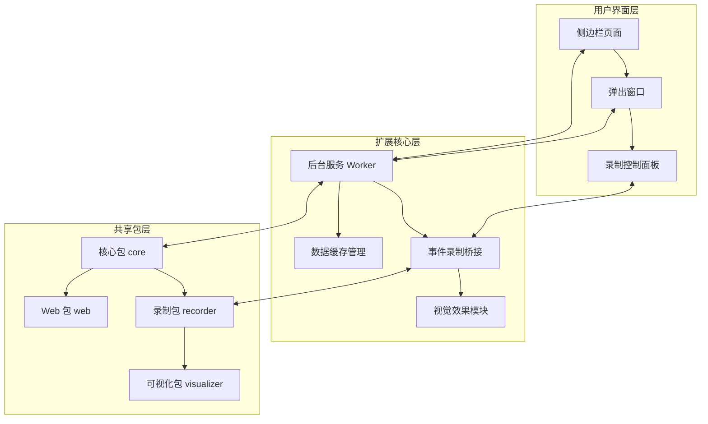
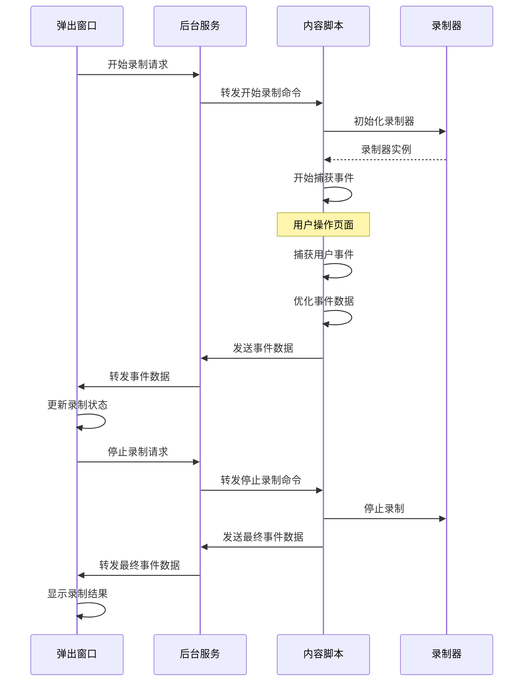

# Chrome 扩展开发架构技术文档

## 1. 项目概览

DongGUI 是一个基于 Chrome 扩展的自动化测试工具，利用 AI 技术通过自然语言实现网页操作的自动化。该扩展提供了录制、回放、生成测试代码等核心功能，帮助开发者更高效地进行前端测试。

### 主要功能
- 网页操作录制与回放
- 测试代码生成（支持 Playwright 等框架）
- 视觉化操作流程
- 侧边栏与弹出窗口交互
- AI 辅助的测试用例生成

## 2. 架构设计

### 2.1 整体架构

DongGUI 采用模块化、分层设计架构，将扩展功能与核心逻辑分离，实现了高度的可维护性和可扩展性。



### 2.2 架构分层

| 层级 | 职责 | 主要文件 | 技术栈 |
|------|------|----------|--------|
| 用户界面层 | 提供用户交互界面 | popup/index.tsx, recorder/index.tsx | React, TypeScript, Less |
| 扩展核心层 | 实现扩展基本功能 | scripts/worker.ts, scripts/event-recorder-bridge.ts | TypeScript, Chrome Extension API |
| 共享包层 | 提供核心业务逻辑 | packages/core, packages/recorder | TypeScript, React |

### 2.3 核心模块关系

1. **后台服务 (Worker)**：作为扩展的中枢神经，处理不同组件间的通信，管理数据缓存，提供截图功能。
2. **事件录制桥接**：连接内容页与扩展，捕获用户操作事件，管理事件流与截图。
3. **录制控制**：提供录制会话管理，包括开始/停止录制、事件存储、测试代码生成等。
4. **视觉效果**：提供操作可视化反馈，增强用户体验。
5. **共享包**：提供跨项目复用的核心功能，如 AI 模型交互、事件处理、UI 组件等。

## 3. 目录结构

```
apps/chrome-extension/
├── scripts/                # 构建脚本
│   ├── pack-extension.js   # 扩展打包脚本
│   └── wait-for-build.js   # 构建等待脚本
├── src/                    # 源代码
│   ├── components/         # 通用组件
│   │   └── playground/     #  playground 组件
│   ├── extension/          # 扩展核心功能
│   │   ├── bridge/         # 桥接组件
│   │   ├── popup/          # 弹出窗口
│   │   ├── recorder/       # 录制功能
│   │   └── common.less      # 通用样式
│   ├── icons/              # 图标资源
│   ├── scripts/            # 脚本文件
│   │   ├── event-recorder-bridge.ts  # 事件录制桥接
│   │   ├── stop-water-flow.ts        # 停止视觉效果
│   │   ├── water-flow.ts             # 视觉效果
│   │   └── worker.ts                 # 后台服务
│   ├── utils/              # 工具函数
│   ├── App.tsx             # 应用主组件
│   ├── index.tsx           # 应用入口
│   └── store.tsx           # 状态管理
├── static/                 # 静态资源
│   ├── fonts/              # 字体文件
│   ├── icon128.png         # 扩展图标
│   └── manifest.json       # 扩展配置
├── rsbuild.config.ts       # 构建配置
└── package.json            # 项目配置
```

## 4. 核心功能模块

### 4.1 后台服务 (Worker)

**功能职责**：
- 管理扩展的生命周期
- 处理跨组件通信
- 提供截图捕获功能
- 缓存数据管理

**核心实现**：
```typescript
// 核心消息处理
chrome.runtime.onMessage.addListener((request, sender, sendResponse) => {
  // 处理截图捕获请求
  if (request.action === 'captureScreenshot') {
    if (sender.tab && sender.tab.id !== undefined) {
      chrome.tabs.captureVisibleTab(
        sender.tab.windowId,
        { format: 'png' },
        (dataUrl) => {
          // 处理截图结果
        }
      );
    }
  }
  
  // 转发录制事件
  if (request.action === 'events' || request.action === 'event') {
    connectedPorts.forEach((port) => {
      try {
        port.postMessage(request);
      } catch (error) {
        // 处理错误
      }
    });
  }
});
```

**关键特性**：
- 使用 `chrome.sidePanel.setPanelBehavior` 配置侧边栏行为
- 维护 `cacheMap` 用于在侧边栏和全屏模式间共享数据
- 使用 `connectedPorts` 管理扩展页面间的通信端口

### 4.2 事件录制系统

**功能职责**：
- 捕获用户在网页上的操作事件
- 优化和过滤事件流
- 关联事件与截图
- 管理录制会话

**核心实现**：
```typescript
// 事件录制初始化
async function initializeRecorder(sessionId: string): Promise<void> {
  window.recorder = new window.EventRecorder(
    async (event: ChromeRecordedEvent) => {
      // 更新最后活动时间
      lastActivityTime = Date.now();
      
      // 优化事件
      const optimizedEvent = window.recorder!.optimizeEvent(event, events);
      
      // 添加事件到本地数组
      events = optimizedEvent;
      
      // 发送更新后的事件数组到扩展
      sendEventsToExtension(optimizedEvent);
    },
    sessionId,
  );
}
```

**关键特性**：
- 事件去重和优化，减少冗余事件
- 智能截图管理，在适当的时机捕获页面状态
- 页面导航和卸载的优雅处理
- 防抖机制，优化事件发送性能

### 4.3 录制控制模块

**功能职责**：
- 管理录制会话的生命周期
- 提供录制控制界面
- 处理录制数据的存储和导出
- 生成测试代码

**核心组件**：
- `Recorder`：录制模块主入口
- `RecordList`：录制会话列表
- `RecordDetail`：录制会话详情
- `ProgressModal`：操作进度模态框

**关键特性**：
- 支持多个录制会话的管理
- 提供详细的事件列表和截图预览
- 集成多种测试代码生成器
- 生命周期清理，防止内存泄漏

### 4.4 视觉效果模块

**功能职责**：
- 提供操作可视化反馈
- 增强用户体验
- 标记操作轨迹

**核心实现**：
```typescript
// 显示鼠标指针
showMousePointer(x: number, y: number) {
  this.enable(); // 显示水流动画
  this.registerSelfCleaning();
  const existingPointer = document.querySelector(
    `div[${this.mousePointerAttribute}]`,
  ) as HTMLDivElement | null;

  // 创建或更新指针元素
  const pointer = existingPointer || (() => {
    const p = document.createElement('div');
    p.setAttribute(this.mousePointerAttribute, 'true');
    p.style.position = 'fixed';
    p.style.width = `${size}px`;
    p.style.height = `${size}px`;
    p.style.borderRadius = '50%';
    p.style.backgroundColor = 'rgba(0, 0, 255, 0.3)';
    p.style.border = '1px solid rgba(0, 0, 255, 0.3)';
    p.style.zIndex = '99999';
    p.style.transition = 'all 1s ease-in';
    p.style.pointerEvents = 'none'; // 使指针不可点击
    document.body.appendChild(p);
    return p;
  })();
}
```

**关键特性**：
- 水流动画效果，增强视觉反馈
- 自动清理机制，避免内存泄漏
- 响应式设计，适配不同页面

## 5. 技术栈与依赖

| 类别 | 技术/库 | 版本 | 用途 | 来源 |
|------|---------|------|------|------|
| 语言 | TypeScript | ^5.0.0 | 主要开发语言 | package.json |
| 框架 | React | ^18.0.0 | UI 开发 | package.json |
| 构建工具 | Rsbuild | ^1.0.0 | 项目构建 | rsbuild.config.ts |
| 样式 | Less | ^4.0.0 | CSS 预处理器 | package.json |
| 扩展 API | Chrome Extension API | Manifest V3 | 扩展功能实现 | manifest.json |
| 代码生成 | Playwright | ^1.30.0 | 测试代码生成 | recorder/generators |
| 状态管理 | React Context | - | 组件状态管理 | 源码 |
| 数据存储 | IndexedDB | - | 持久化存储 | utils/indexedDB.ts |

## 6. 核心 API/类/函数

### 6.1 Worker 相关

#### `chrome.runtime.onMessage.addListener`
- **功能**：监听来自扩展其他部分的消息
- **参数**：
  - `request`：消息内容
  - `sender`：消息发送者
  - `sendResponse`：响应回调函数
- **返回值**：布尔值，表示是否异步响应
- **应用场景**：处理截图请求、事件转发等

#### `chrome.sidePanel.setPanelBehavior`
- **功能**：设置侧边栏行为
- **参数**：
  - `options`：配置选项，如 `openPanelOnActionClick`
- **返回值**：Promise
- **应用场景**：配置点击扩展图标时自动打开侧边栏

### 6.2 事件录制相关

#### `initializeRecorder`
- **功能**：初始化事件录制器
- **参数**：
  - `sessionId`：录制会话 ID
- **返回值**：Promise<void>
- **应用场景**：开始新的录制会话

#### `sendEventsToExtension`
- **功能**：将录制的事件发送到扩展
- **参数**：
  - `optimizedEvent`：优化后的事件数组
  - `immediate`：是否立即发送
- **返回值**：Promise<void>
- **应用场景**：事件录制过程中发送数据

### 6.3 录制控制相关

#### `useRecordingSession`
- **功能**：管理录制会话状态
- **返回值**：包含会话状态和操作方法的对象
- **应用场景**：录制控制面板中使用

#### `useRecordingControl`
- **功能**：提供录制控制功能
- **返回值**：包含开始、停止、暂停等控制方法的对象
- **应用场景**：录制控制按钮组

### 6.4 视觉效果相关

#### `midsceneWaterFlowAnimation.enable`
- **功能**：启用水流动画效果
- **应用场景**：操作录制过程中提供视觉反馈

#### `midsceneWaterFlowAnimation.showMousePointer`
- **功能**：显示鼠标指针效果
- **参数**：
  - `x`：鼠标 X 坐标
  - `y`：鼠标 Y 坐标
- **应用场景**：标记鼠标点击位置

## 7. 数据流与通信

### 7.1 扩展内部通信



### 7.2 数据存储

- **内存缓存**：使用 `Map` 存储临时数据，如 `cacheMap` 用于在侧边栏和全屏模式间共享数据
- **IndexedDB**：用于持久化存储录制会话数据
- **LocalStorage**：存储用户偏好设置和扩展配置

### 7.3 消息传递

| 消息类型 | 发送方 | 接收方 | 用途 |
|---------|--------|--------|------|
| `captureScreenshot` | 内容脚本 | 后台服务 | 请求捕获页面截图 |
| `events` | 内容脚本 | 后台服务 | 发送录制的事件数据 |
| `start` | 弹出窗口 | 内容脚本 | 开始录制 |
| `stop` | 弹出窗口 | 内容脚本 | 停止录制 |
| `save-context` | 侧边栏 | 后台服务 | 保存上下文数据 |
| `get-context` | 全屏模式 | 后台服务 | 获取上下文数据 |

## 8. 构建与部署

### 8.1 构建流程

DongGUI 使用 Rsbuild 作为构建工具，支持多环境构建：

1. **Web 环境**：构建侧边栏和弹出窗口
   - 入口文件：`src/index.tsx`, `src/extension/popup/index.tsx`
   - 输出目标：`web`

2. **IIFE 环境**：构建脚本文件
   - 入口文件：`src/scripts/worker.ts`, `src/scripts/event-recorder-bridge.ts` 等
   - 输出目标：`web-worker`

### 8.2 构建配置

```typescript
// rsbuild.config.ts 核心配置
export default defineConfig({
  environments: {
    web: {
      source: {
        entry: {
          index: './src/index.tsx',
          popup: './src/extension/popup/index.tsx',
        },
      },
    },
    iife: {
      source: {
        entry: {
          worker: './src/scripts/worker.ts',
          'stop-water-flow': './src/scripts/stop-water-flow.ts',
          'water-flow': './src/scripts/water-flow.ts',
          'event-recorder-bridge': './src/scripts/event-recorder-bridge.ts',
        },
      },
    },
  },
  output: {
    copy: [
      { from: './static', to: './' },
      {
        from: path.resolve(__dirname, '../../packages/shared/dist-inspect'),
        to: 'scripts',
      },
      {
        from: path.resolve(
          __dirname,
          '../../packages/recorder/dist/recorder-iife.js',
        ),
        to: 'scripts',
      },
    ],
  },
});
```

### 8.3 部署流程

1. **开发环境**：
   - 运行 `npm run dev` 启动开发服务器
   - 在 Chrome 扩展管理页面加载 unpacked 扩展
   - 代码修改会自动热更新

2. **生产环境**：
   - 运行 `npm run build` 构建生产版本
   - 使用 `scripts/pack-extension.js` 打包扩展
   - 生成的扩展包可用于 Chrome Web Store 发布

## 9. 监控与维护

### 9.1 日志系统

- **控制台日志**：使用 `console.log` 和 `console.error` 记录关键操作和错误
- **结构化日志**：在关键函数中使用结构化对象记录详细信息
- **性能监控**：记录事件处理时间和截图捕获时间

### 9.2 错误处理

- **异步错误捕获**：使用 try-catch 捕获异步操作错误
- **Promise 错误处理**：使用 .catch() 处理 Promise 链错误
- **网络错误处理**：优雅处理消息传递失败的情况
- **资源清理**：确保在错误发生时正确清理资源

### 9.3 常见问题与解决方案

| 问题 | 原因 | 解决方案 |
|------|------|----------|
| 录制的事件过多 | 事件去重机制不完善 | 优化事件过滤算法 |
| 截图捕获失败 | 页面权限或安全限制 | 增加重试机制和错误处理 |
| 扩展崩溃 | 内存泄漏 | 实现更严格的资源清理 |
| 录制会话丢失 | 页面刷新或导航 | 实现会话持久化存储 |

## 10. 扩展与集成

### 10.1 与核心包集成

DongGUI 扩展紧密集成了多个核心包，实现了功能的模块化和复用：

- **@midscene/core**：提供基础功能和工具
- **@midscene/recorder**：提供事件录制核心逻辑
- **@midscene/visualizer**：提供可视化组件
- **@midscene/web**：提供 Web 相关功能

### 10.2 与外部工具集成

- **Playwright**：生成 Playwright 测试代码
- **YAML**：生成 YAML 格式的测试用例
- **AI 模型**：集成 AI 技术生成测试用例描述

### 10.3 API 扩展点

- **测试代码生成器**：可扩展支持更多测试框架
- **事件处理器**：可扩展支持更多类型的事件
- **视觉效果**：可扩展支持更多视觉反馈效果
- **存储策略**：可扩展支持更多存储后端

## 11. 未来发展方向

### 11.1 功能增强

- **AI 驱动的测试用例生成**：利用大语言模型自动生成更智能的测试用例
- **跨浏览器支持**：扩展到 Firefox、Edge 等其他浏览器
- **云同步**：支持录制会话的云存储和同步
- **团队协作**：添加团队共享和协作功能

### 11.2 性能优化

- **事件处理性能**：进一步优化事件捕获和处理性能
- **内存使用**：减少扩展的内存占用
- **启动速度**：加快扩展的启动和加载速度
- **截图优化**：减少截图大小和捕获时间

### 11.3 架构演进

- **微前端架构**：采用微前端架构，进一步模块化功能
- **插件系统**：引入插件系统，支持第三方扩展
- **TypeScript 类型增强**：提供更完善的类型定义
- **自动化测试**：为扩展本身添加自动化测试

## 12. 总结

DongGUI Chrome 扩展采用现代化的架构设计，将扩展功能与核心逻辑分离，实现了高度的模块化和可扩展性。通过分层设计、模块化组件和共享包的使用，该扩展不仅提供了强大的功能，还保持了代码的清晰性和可维护性。

该架构的关键优势包括：

1. **模块化设计**：各功能模块职责清晰，边界明确
2. **共享包复用**：核心逻辑抽象到共享包，可被其他项目复用
3. **高性能实现**：事件优化、防抖机制等技术提高了性能
4. **良好的用户体验**：视觉效果、流畅的交互等提升了用户体验
5. **可扩展性强**：架构设计支持功能的持续扩展和增强

DongGUI 展示了如何构建一个功能强大、性能优异的 Chrome 扩展，为类似项目的开发提供了有价值的参考。