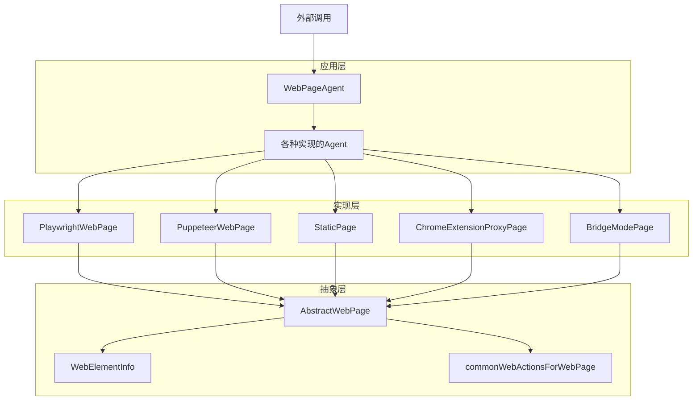
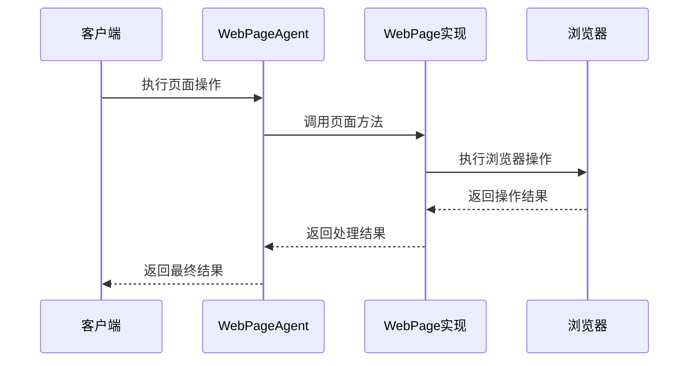
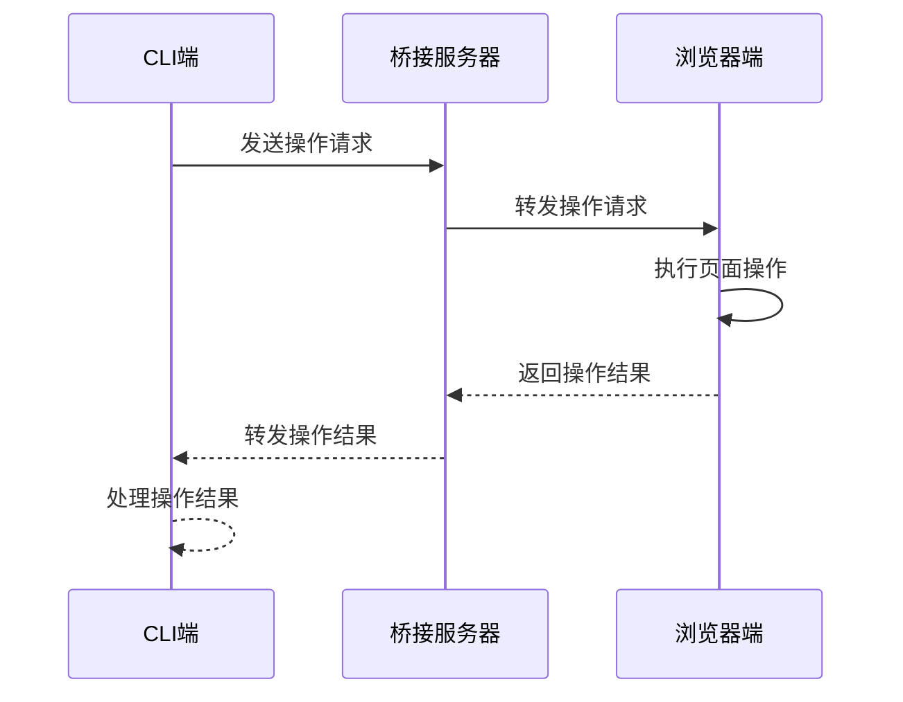
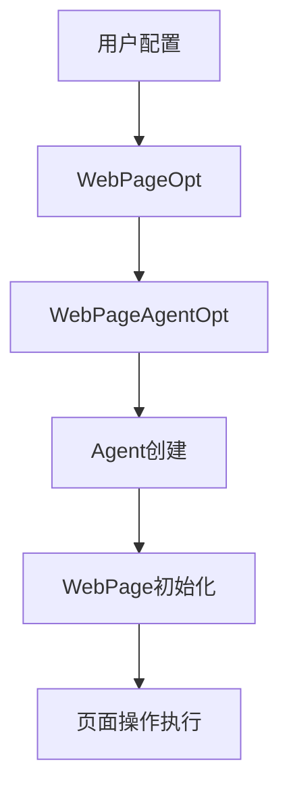

# Web Integration 模块技术架构文档

## 1. 项目概览

Web Integration 模块是 Midscene 中的核心模块，提供了 Web 页面操作的抽象层和多种实现，支持通过不同的浏览器自动化框架（如 Playwright、Puppeteer）以及静态分析、Chrome 扩展等方式操作 Web 页面。

### 主要功能
- 统一的 Web 页面操作接口
- 支持多种浏览器自动化框架
- 静态页面分析能力
- Chrome 扩展集成
- 桥接模式实现远程操作
- 丰富的页面交互能力（点击、输入、滚动、拖拽等）
- AI 辅助的页面操作和测试

## 2. 架构设计

### 2.1 整体架构

Web Integration 模块采用分层设计架构，将页面操作抽象为统一接口，然后由不同的实现提供具体功能。



### 2.2 架构分层

| 层级 | 职责 | 主要文件 | 技术栈 |
|------|------|----------|--------|
| 抽象层 | 定义统一接口和基础功能 | web-page.ts, web-element.ts | TypeScript |
| 实现层 | 提供具体的页面操作实现 | playwright/page.ts, puppeteer/page.ts, static/static-page.ts, chrome-extension/page.ts | TypeScript, Playwright, Puppeteer |
| 应用层 | 提供完整的Agent实现 | playwright/index.ts, puppeteer/index.ts, static/index.ts, chrome-extension/index.ts | TypeScript |

### 2.3 核心模块关系

1. **抽象层**：定义了 `AbstractWebPage` 基类和 `WebElementInfo` 接口，提供了统一的页面操作能力。
2. **实现层**：各实现类继承 `AbstractWebPage`，提供具体的页面操作实现。
3. **应用层**：将页面操作与Agent结合，提供完整的Web页面操作能力。

## 3. 目录结构

```
packages/web-integration/
├── src/
│   ├── bridge-mode/        # 桥接模式实现
│   ├── chrome-extension/   # Chrome扩展集成
│   ├── playwright/         # Playwright实现
│   ├── puppeteer/          # Puppeteer实现
│   ├── static/             # 静态页面分析
│   ├── bin.ts              # 命令行工具
│   ├── index.ts            # 模块入口
│   ├── web-element.ts      # Web元素定义
│   ├── web-page.ts         # Web页面抽象
│   └── utils.ts            # 工具函数
├── tests/                  # 测试代码
├── README.md               # 说明文档
├── package.json            # 项目配置
└── rslib.config.ts         # 构建配置
```

## 4. 核心功能模块

### 4.1 Web 页面抽象

**功能职责**：
- 定义统一的 Web 页面操作接口
- 提供基础的页面操作能力
- 为不同实现提供统一的抽象

**核心实现**：
```typescript
export abstract class AbstractWebPage extends AbstractInterface {
  navigate?(url: string): Promise<void>;
  reload?(): Promise<void>;
  goBack?(): Promise<void>;

  get mouse(): MouseAction {
    return {
      click: async (x: number, y: number, options: { button: MouseButton }) => {},
      wheel: async (deltaX: number, deltaY: number) => {},
      move: async (x: number, y: number) => {},
      drag: async (from: { x: number; y: number }, to: { x: number; y: number }) => {},
    };
  }

  get keyboard(): KeyboardAction {
    return {
      type: async (text: string) => {},
      press: async (action: { key: KeyInput; command?: string } | { key: KeyInput; command?: string }[]) => {},
    };
  }

  abstract scrollUntilTop(startingPoint?: Point): Promise<void>;
  abstract scrollUntilBottom(startingPoint?: Point): Promise<void>;
  abstract scrollUntilLeft(startingPoint?: Point): Promise<void>;
  abstract scrollUntilRight(startingPoint?: Point): Promise<void>;
  abstract scrollUp(distance?: number, startingPoint?: Point): Promise<void>;
  abstract scrollDown(distance?: number, startingPoint?: Point): Promise<void>;
  abstract scrollLeft(distance?: number, startingPoint?: Point): Promise<void>;
  abstract scrollRight(distance?: number, startingPoint?: Point): Promise<void>;
  abstract longPress(x: number, y: number, duration?: number): Promise<void>;
  abstract swipe(from: { x: number; y: number }, to: { x: number; y: number }, duration?: number): Promise<void>;
}
```

**关键特性**：
- 提供了鼠标、键盘操作的抽象接口
- 定义了页面导航、滚动等核心操作
- 支持触摸事件（通过配置）
- 为所有具体实现提供统一的基础

### 4.2 Web 元素管理

**功能职责**：
- 定义 Web 元素的信息结构
- 提供元素定位和交互能力
- 支持元素属性和状态管理

**核心实现**：
```typescript
export class WebElementInfoImpl implements WebElementInfo {
  content: string;
  rect: Rect;
  center: [number, number];
  id: string;
  indexId: number;
  attributes: {
    nodeType: NodeType;
    [key: string]: string;
  };
  xpaths?: string[];
  isVisible: boolean;

  constructor({
    content,
    rect,
    id,
    attributes,
    indexId,
    xpaths,
    isVisible,
  }: {
    content: string;
    rect: Rect;
    id: string;
    attributes: {
      nodeType: NodeType;
      [key: string]: string;
    };
    indexId: number;
    xpaths?: string[];
    isVisible: boolean;
  }) {
    this.content = content;
    this.rect = rect;
    this.center = [
      Math.floor(rect.left + rect.width / 2),
      Math.floor(rect.top + rect.height / 2),
    ];
    this.id = id;
    this.attributes = attributes;
    this.indexId = indexId;
    this.xpaths = xpaths;
    this.isVisible = isVisible;
  }
}
```

**关键特性**：
- 包含元素的位置、大小、内容等信息
- 支持 XPath 定位
- 提供元素可见性判断
- 为元素交互提供基础信息

### 4.3 通用 Web 操作

**功能职责**：
- 为 Web 页面提供通用的设备操作
- 支持点击、输入、滚动、拖拽等操作
- 统一不同实现的操作接口

**核心实现**：
```typescript
export const commonWebActionsForWebPage = <T extends AbstractWebPage>(
  page: T,
  includeTouchEvents = false,
): DeviceAction<any>[] => [
  defineActionTap(async (param) => {
    const element = param.locate;
    assert(element, 'Element not found, cannot tap');

    await page.mouse.click(element.center[0], element.center[1], {
      button: 'left',
    });
  }),
  // 其他操作定义...
];
```

**关键特性**：
- 提供了丰富的页面操作能力
- 支持触摸事件（可选）
- 统一了不同实现的操作接口
- 包含了导航、重载等页面级操作

### 4.4 Playwright 实现

**功能职责**：
- 使用 Playwright 实现 Web 页面操作
- 提供 Playwright 特有的功能
- 支持现代浏览器自动化

**核心组件**：
- `PlaywrightWebPage`：Playwright 页面实现
- `PlaywrightAgent`：Playwright 代理实现
- `ai-fixture.ts`：Playwright 测试 fixture

**关键特性**：
- 支持多种浏览器（Chrome、Firefox、Safari）
- 提供高性能的页面操作
- 集成了 Playwright 的测试能力
- 支持网络请求拦截和模拟

### 4.5 Puppeteer 实现

**功能职责**：
- 使用 Puppeteer 实现 Web 页面操作
- 提供 Puppeteer 特有的功能
- 支持 Chrome/Chromium 浏览器自动化

**核心组件**：
- `PuppeteerWebPage`：Puppeteer 页面实现
- `PuppeteerAgent`：Puppeteer 代理实现

**关键特性**：
- 专注于 Chrome/Chromium 浏览器
- 提供丰富的 Chrome 特有的功能
- 支持 CDP (Chrome DevTools Protocol)

### 4.6 静态页面分析

**功能职责**：
- 分析静态 HTML 页面
- 提供无需浏览器的页面分析能力
- 支持离线场景

**核心组件**：
- `StaticPage`：静态页面实现
- `StaticAgent`：静态页面代理实现

**关键特性**：
- 无需启动浏览器，快速分析
- 支持离线 HTML 文件分析
- 提供基本的页面结构分析

### 4.7 Chrome 扩展集成

**功能职责**：
- 与 Chrome 扩展集成，实现浏览器内操作
- 提供扩展特有的功能
- 支持用户在浏览器中的实时操作

**核心组件**：
- `ChromeExtensionProxyPage`：Chrome 扩展页面实现
- `ChromeExtensionAgent`：Chrome 扩展代理实现

**关键特性**：
- 与 Chrome 扩展无缝集成
- 支持用户在浏览器中的实时操作
- 提供扩展特有的功能和交互

### 4.8 桥接模式

**功能职责**：
- 实现远程 Web 页面操作
- 支持跨网络的页面控制
- 提供客户端-服务器模式的操作能力

**核心组件**：
- `PageBrowserSide`：浏览器端页面实现
- `AgentCliSide`：CLI 端代理实现

**关键特性**：
- 支持远程页面操作
- 提供客户端-服务器模式
- 实现跨网络的页面控制

## 5. 技术栈与依赖

| 类别 | 技术/库 | 版本 | 用途 | 来源 |
|------|---------|------|------|------|
| 语言 | TypeScript | ^5.0.0 | 主要开发语言 | package.json |
| 浏览器自动化 | Playwright | ^1.30.0 | 现代浏览器自动化 | playwright/index.ts |
| 浏览器自动化 | Puppeteer | ^20.0.0 | Chrome/Chromium 自动化 | puppeteer/index.ts |
| 核心依赖 | @midscene/core | 本地 | 核心功能和类型定义 | index.ts |
| 核心依赖 | @midscene/shared | 本地 | 共享工具和函数 | index.ts |
| 构建工具 | RSLib | ^0.10.0 | 项目构建 | rslib.config.ts |

## 6. 核心 API/类/函数

### 6.1 AbstractWebPage

**功能**：Web 页面的抽象基类，定义了页面操作的接口
**主要方法**：
- `navigate(url)`：导航到指定 URL
- `reload()`：重载当前页面
- `goBack()`：返回上一页
- `scrollUntilTop()`：滚动到页面顶部
- `scrollUntilBottom()`：滚动到页面底部
- `scrollUp(distance)`：向上滚动指定距离
- `scrollDown(distance)`：向下滚动指定距离
- `longPress(x, y, duration)`：长按指定位置
- `swipe(from, to, duration)`：从一个位置滑动到另一个位置

**应用场景**：作为所有 Web 页面实现的基类，提供统一的接口

### 6.2 WebElementInfo

**功能**：表示 Web 页面中的元素信息
**主要属性**：
- `content`：元素内容
- `rect`：元素位置和大小
- `center`：元素中心点坐标
- `id`：元素 ID
- `attributes`：元素属性
- `xpaths`：元素的 XPath 路径
- `isVisible`：元素是否可见

**应用场景**：用于元素定位和交互

### 6.3 commonWebActionsForWebPage

**功能**：为 Web 页面提供通用的设备操作
**参数**：
- `page`：Web 页面实例
- `includeTouchEvents`：是否包含触摸事件
**返回值**：设备操作数组

**应用场景**：为不同的 Web 页面实现提供统一的操作能力

### 6.4 WebPageContextParser

**功能**：解析 Web 页面的上下文信息
**参数**：
- `page`：页面实例
- `_opt`：选项，包含上传服务器 URL
**返回值**：UI 上下文信息

**应用场景**：用于 AI 辅助的页面操作和分析

### 6.5 limitOpenNewTabScript

**功能**：限制新标签页打开，强制在当前标签页导航
**类型**：字符串（JavaScript 代码）

**应用场景**：用于测试场景，确保所有导航都在当前标签页进行

## 7. 数据流与通信

### 7.1 页面操作流程



### 7.2 桥接模式通信



### 7.3 配置数据流



## 8. 构建与部署

### 8.1 构建流程

Web Integration 模块使用 RSLib 进行构建：

1. **开发环境**：
   - 运行 `npm run dev` 启动开发服务器
   - 支持代码热更新

2. **生产环境**：
   - 运行 `npm run build` 构建生产版本
   - 生成的文件位于 `dist` 目录

### 8.2 部署方式

作为一个核心模块，Web Integration 主要通过 npm 包的方式被其他模块引用：

1. **本地开发**：
   - 使用 `pnpm link` 或 `npm link` 在本地链接
   - 支持实时修改和测试

2. **发布部署**：
   - 运行 `npm publish` 发布到 npm  registry
   - 其他模块通过 `npm install @midscene/web-integration` 安装使用

## 9. 监控与维护

### 9.1 日志系统

- **调试日志**：使用 `debug` 模块记录调试信息
- **错误处理**：使用 try-catch 捕获和处理错误
- **性能监控**：记录操作执行时间

### 9.2 错误处理

- **页面操作错误**：捕获并处理页面操作过程中的错误
- **网络错误**：处理网络请求失败的情况
- **元素定位错误**：处理元素未找到的情况
- **超时错误**：处理操作超时的情况

### 9.3 常见问题与解决方案

| 问题 | 原因 | 解决方案 |
|------|------|----------|
| 元素不可见 | 元素被遮挡或未加载 | 使用等待机制或滚动到元素可见 |
| 操作超时 | 页面加载缓慢或操作复杂 | 增加超时时间或优化操作流程 |
| 浏览器启动失败 | 浏览器未安装或版本不兼容 | 检查浏览器安装情况或使用兼容版本 |
| 网络请求失败 | 网络连接问题或 CORS 限制 | 检查网络连接或配置 CORS |

## 10. 扩展与集成

### 10.1 与其他模块集成

- **@midscene/core**：使用核心模块的类型定义和功能
- **@midscene/playground**：集成到 Playground 中，提供 Web 页面操作能力
- **@midscene/cli**：通过 CLI 提供 Web 页面操作命令

### 10.2 外部工具集成

- **Playwright Test**：集成到 Playwright 测试框架中
- **Jest**：支持使用 Jest 进行测试
- **Vitest**：支持使用 Vitest 进行测试

### 10.3 API 扩展点

- **自定义操作**：通过 `customActions` 配置添加自定义操作
- **操作前钩子**：通过 `beforeInvokeAction` 添加操作前处理
- **操作后钩子**：通过 `afterInvokeAction` 添加操作后处理
- **浏览器配置**：通过各种选项配置浏览器行为

## 11. 未来发展方向

### 11.1 功能增强

- **更多浏览器支持**：扩展到更多浏览器和平台
- **更丰富的页面操作**：添加更多高级页面操作能力
- **更智能的元素定位**：使用 AI 技术提高元素定位的准确性
- **更全面的测试集成**：与更多测试框架集成

### 11.2 性能优化

- **页面操作性能**：优化页面操作的执行速度
- **内存使用**：减少内存占用，特别是在长时间运行的场景
- **启动速度**：加快浏览器启动和页面加载速度
- **网络请求**：优化网络请求处理

### 11.3 架构演进

- **模块化增强**：进一步模块化代码，提高可维护性
- **TypeScript 类型增强**：提供更完善的类型定义
- **插件系统**：引入插件系统，支持第三方扩展
- **统一的配置系统**：提供更统一和灵活的配置系统

## 12. 总结

Web Integration 模块是 Midscene 中的核心模块，提供了统一的 Web 页面操作抽象和多种实现，支持通过不同的浏览器自动化框架以及静态分析、Chrome 扩展等方式操作 Web 页面。

### 核心优势

1. **统一的抽象接口**：定义了统一的 Web 页面操作接口，使不同实现可以无缝切换
2. **多种实现支持**：支持 Playwright、Puppeteer、静态分析、Chrome 扩展等多种方式
3. **丰富的操作能力**：提供了点击、输入、滚动、拖拽等丰富的页面操作能力
4. **AI 辅助能力**：集成了 AI 辅助的页面操作和分析能力
5. **高度可配置**：提供了丰富的配置选项，支持各种场景

### 技术价值

Web Integration 模块不仅为 Midscene 提供了核心的 Web 页面操作能力，也为类似项目提供了一个优秀的参考架构。它展示了如何构建一个灵活、可扩展的 Web 页面操作系统，支持多种浏览器自动化框架和使用场景。

通过抽象层的设计和多种实现的支持，Web Integration 模块实现了高度的模块化和可扩展性，使代码更易于维护和扩展。同时，它也展示了如何将现代浏览器自动化技术与 AI 技术结合，提供更智能的 Web 页面操作能力。

### 应用前景

随着 Web 应用的复杂度不断增加，对 Web 页面操作和测试的需求也在不断增长。Web Integration 模块提供的能力可以应用于以下场景：

1. **自动化测试**：通过 Playwright、Puppeteer 等实现 Web 应用的自动化测试
2. **页面分析**：通过静态分析或浏览器自动化分析 Web 页面结构和性能
3. **用户行为模拟**：模拟用户在 Web 页面上的操作，进行行为分析或压力测试
4. **AI 辅助操作**：使用 AI 技术辅助 Web 页面操作，提高操作的准确性和效率
5. **浏览器扩展**：通过 Chrome 扩展集成，为用户提供浏览器内的增强功能

Web Integration 模块的设计和实现为这些应用场景提供了坚实的技术基础，具有广阔的应用前景。